<a name="Query">Query:</a>

 <map name="Query.map"><area shape="rect" coords="29,1,101,33" href="#Prologue" title="Prologue"> <area shape="rect" coords="141,1,233,33" href="#SelectQuery" title="SelectQuery"> <area shape="rect" coords="141,45,255,77" href="#ConstructQuery" title="ConstructQuery"> <area shape="rect" coords="141,89,247,121" href="#DescribeQuery" title="DescribeQuery"> <area shape="rect" coords="141,133,219,165" href="#AskQuery" title="AskQuery"></map>

<div class="ebnf">

```
Query    ::= Prologue ( SelectQuery | ConstructQuery | DescribeQuery | AskQuery )
```

</div>

no references

<a name="Prologue">Prologue:</a>

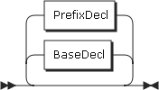 <map name="Prologue.map"><area shape="rect" coords="49,67,123,99" href="#BaseDecl" title="BaseDecl"> <area shape="rect" coords="183,1,261,33" href="#PrefixDecl" title="PrefixDecl"></map>

<div class="ebnf">

<pre>[Prologue](#Prologue "Prologue") ::= [BaseDecl](#BaseDecl "BaseDecl")? [PrefixDecl](#PrefixDecl "PrefixDecl")*</pre>

</div>

referenced by:

*   [Query](#Query "Query")

<a name="BaseDecl">BaseDecl:</a>

 <map name="BaseDecl.map"><area shape="rect" coords="103,1,169,33" href="#IRI_REF" title="IRI_REF"></map>

<div class="ebnf">

<pre>[BaseDecl](#BaseDecl "BaseDecl") ::= 'BASE' [IRI_REF](#IRI_REF "IRI_REF")</pre>

</div>

referenced by:

*   [Prologue](#Prologue "Prologue")

<a name="PrefixDecl">PrefixDecl:</a>

 <map name="PrefixDecl.map"><area shape="rect" coords="119,1,205,33" href="#PNAME_NS" title="PNAME_NS"> <area shape="rect" coords="225,1,291,33" href="#IRI_REF" title="IRI_REF"></map>

<div class="ebnf">

<pre>[PrefixDecl](#PrefixDecl "PrefixDecl")
         ::= 'PREFIX' [PNAME_NS](#PNAME_NS "PNAME_NS") [IRI_REF](#IRI_REF "IRI_REF")</pre>

</div>

referenced by:

*   [Prologue](#Prologue "Prologue")

<a name="SelectQuery">SelectQuery:</a>

 <map name="SelectQuery.map"><area shape="rect" coords="305,35,345,67" href="#Var" title="Var"> <area shape="rect" coords="425,1,531,33" href="#DatasetClause" title="DatasetClause"> <area shape="rect" coords="571,35,669,67" href="#WhereClause" title="WhereClause"> <area shape="rect" coords="689,35,803,67" href="#SolutionModifier" title="SolutionModifier"></map>

<div class="ebnf">

<pre>[SelectQuery](#SelectQuery "SelectQuery")
         ::= 'SELECT' ( 'DISTINCT' | 'REDUCED' )? ( [Var](#Var "Var")+ | '*' ) [DatasetClause](#DatasetClause "DatasetClause")* [WhereClause](#WhereClause "WhereClause") [SolutionModifier](#SolutionModifier "SolutionModifier")</pre>

</div>

referenced by:

*   [Query](#Query "Query")

<a name="ConstructQuery">ConstructQuery:</a>

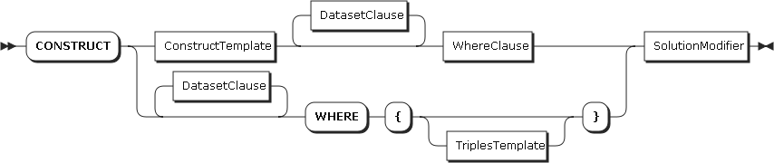 <map name="ConstructQuery.map"><area shape="rect" coords="151,35,283,67" href="#ConstructTemplate" title="ConstructTemplate"> <area shape="rect" coords="323,1,429,33" href="#DatasetClause" title="DatasetClause"> <area shape="rect" coords="469,35,567,67" href="#WhereClause" title="WhereClause"> <area shape="rect" coords="587,35,701,67" href="#SolutionModifier" title="SolutionModifier"></map>

<div class="ebnf">

<pre>[ConstructQuery](#ConstructQuery "ConstructQuery")
         ::= 'CONSTRUCT' [ConstructTemplate](#ConstructTemplate "ConstructTemplate") [DatasetClause](#DatasetClause "DatasetClause")* [WhereClause](#WhereClause "WhereClause") [SolutionModifier](#SolutionModifier "SolutionModifier")</pre>

</div>

referenced by:

*   [Query](#Query "Query")

<a name="DescribeQuery">DescribeQuery:</a>

 <map name="DescribeQuery.map"><area shape="rect" coords="177,35,263,67" href="#VarOrIRIref" title="VarOrIRIref"> <area shape="rect" coords="343,1,449,33" href="#DatasetClause" title="DatasetClause"> <area shape="rect" coords="509,67,607,99" href="#WhereClause" title="WhereClause"> <area shape="rect" coords="647,35,761,67" href="#SolutionModifier" title="SolutionModifier"></map>

<div class="ebnf">

<pre>[DescribeQuery](#DescribeQuery "DescribeQuery")
         ::= 'DESCRIBE' ( [VarOrIRIref](#VarOrIRIref "VarOrIRIref")+ | '*' ) [DatasetClause](#DatasetClause "DatasetClause")* [WhereClause](#WhereClause "WhereClause")? [SolutionModifier](#SolutionModifier "SolutionModifier")</pre>

</div>

referenced by:

*   [Query](#Query "Query")

<a name="AskQuery">AskQuery:</a>

 <map name="AskQuery.map"><area shape="rect" coords="117,1,223,33" href="#DatasetClause" title="DatasetClause"> <area shape="rect" coords="263,35,361,67" href="#WhereClause" title="WhereClause"></map>

<div class="ebnf">

<pre>[AskQuery](#AskQuery "AskQuery") ::= 'ASK' [DatasetClause](#DatasetClause "DatasetClause")* [WhereClause](#WhereClause "WhereClause")</pre>

</div>

referenced by:

*   [Query](#Query "Query")

<a name="DatasetClause">DatasetClause:</a>

 <map name="DatasetClause.map"><area shape="rect" coords="127,1,263,33" href="#DefaultGraphClause" title="DefaultGraphClause"> <area shape="rect" coords="127,45,265,77" href="#NamedGraphClause" title="NamedGraphClause"></map>

<div class="ebnf">

<pre>[DatasetClause](#DatasetClause "DatasetClause")
         ::= 'FROM' ( [DefaultGraphClause](#DefaultGraphClause "DefaultGraphClause") | [NamedGraphClause](#NamedGraphClause "NamedGraphClause") )</pre>

</div>

referenced by:

*   [AskQuery](#AskQuery "AskQuery")
*   [ConstructQuery](#ConstructQuery "ConstructQuery")
*   [DescribeQuery](#DescribeQuery "DescribeQuery")
*   [SelectQuery](#SelectQuery "SelectQuery")

<a name="DefaultGraphClause">DefaultGraphClause:</a>

 <map name="DefaultGraphClause.map"><area shape="rect" coords="29,1,139,33" href="#SourceSelector" title="SourceSelector"></map>

<div class="ebnf">

<pre>[DefaultGraphClause](#DefaultGraphClause "DefaultGraphClause")
         ::= [SourceSelector](#SourceSelector "SourceSelector")</pre>

</div>

referenced by:

*   [DatasetClause](#DatasetClause "DatasetClause")

<a name="NamedGraphClause">NamedGraphClause:</a>

 <map name="NamedGraphClause.map"><area shape="rect" coords="117,1,227,33" href="#SourceSelector" title="SourceSelector"></map>

<div class="ebnf">

<pre>[NamedGraphClause](#NamedGraphClause "NamedGraphClause")
         ::= 'NAMED' [SourceSelector](#SourceSelector "SourceSelector")</pre>

</div>

referenced by:

*   [DatasetClause](#DatasetClause "DatasetClause")

<a name="SourceSelector">SourceSelector:</a>

 <map name="SourceSelector.map"><area shape="rect" coords="29,1,81,33" href="#IRIref" title="IRIref"></map>

<div class="ebnf">

<pre>[SourceSelector](#SourceSelector "SourceSelector")
         ::= [IRIref](#IRIref "IRIref")</pre>

</div>

referenced by:

*   [DefaultGraphClause](#DefaultGraphClause "DefaultGraphClause")
*   [NamedGraphClause](#NamedGraphClause "NamedGraphClause")

<a name="WhereClause">WhereClause:</a>

 <map name="WhereClause.map"><area shape="rect" coords="157,1,293,33" href="#GroupGraphPattern" title="GroupGraphPattern"></map>

<div class="ebnf">

<pre>[WhereClause](#WhereClause "WhereClause")
         ::= 'WHERE'? [GroupGraphPattern](#GroupGraphPattern "GroupGraphPattern")</pre>

</div>

referenced by:

*   [AskQuery](#AskQuery "AskQuery")
*   [ConstructQuery](#ConstructQuery "ConstructQuery")
*   [DescribeQuery](#DescribeQuery "DescribeQuery")
*   [SelectQuery](#SelectQuery "SelectQuery")

<a name="SolutionModifier">SolutionModifier:</a>

 <map name="SolutionModifier.map"><area shape="rect" coords="49,21,141,53" href="#OrderClause" title="OrderClause"> <area shape="rect" coords="201,21,331,53" href="#LimitOffsetClauses" title="LimitOffsetClauses"></map>

<div class="ebnf">

<pre>[SolutionModifier](#SolutionModifier "SolutionModifier")
         ::= [OrderClause](#OrderClause "OrderClause")? [LimitOffsetClauses](#LimitOffsetClauses "LimitOffsetClauses")?</pre>

</div>

referenced by:

*   [ConstructQuery](#ConstructQuery "ConstructQuery")
*   [DescribeQuery](#DescribeQuery "DescribeQuery")
*   [SelectQuery](#SelectQuery "SelectQuery")

<a name="LimitOffsetClauses">LimitOffsetClauses:</a>

 <map name="LimitOffsetClauses.map"><area shape="rect" coords="49,1,135,33" href="#LimitClause" title="LimitClause"> <area shape="rect" coords="175,33,269,65" href="#OffsetClause" title="OffsetClause"> <area shape="rect" coords="49,77,143,109" href="#OffsetClause" title="OffsetClause"> <area shape="rect" coords="183,109,269,141" href="#LimitClause" title="LimitClause"></map>

<div class="ebnf">

<pre>[LimitOffsetClauses](#LimitOffsetClauses "LimitOffsetClauses")
         ::= [LimitClause](#LimitClause "LimitClause") [OffsetClause](#OffsetClause "OffsetClause")?
           | [OffsetClause](#OffsetClause "OffsetClause") [LimitClause](#LimitClause "LimitClause")?</pre>

</div>

referenced by:

*   [SolutionModifier](#SolutionModifier "SolutionModifier")

<a name="OrderClause">OrderClause:</a>

 <map name="OrderClause.map"><area shape="rect" coords="193,17,303,49" href="#OrderCondition" title="OrderCondition"></map>

<div class="ebnf">

<pre>[OrderClause](#OrderClause "OrderClause")
         ::= 'ORDER' 'BY' [OrderCondition](#OrderCondition "OrderCondition")+</pre>

</div>

referenced by:

*   [SolutionModifier](#SolutionModifier "SolutionModifier")

<a name="OrderCondition">OrderCondition:</a>

 <map name="OrderCondition.map"><area shape="rect" coords="163,1,311,33" href="#BrackettedExpression" title="BrackettedExpression"> <area shape="rect" coords="49,89,131,121" href="#Constraint" title="Constraint"> <area shape="rect" coords="49,133,89,165" href="#Var" title="Var"></map>

<div class="ebnf">

<pre>[OrderCondition](#OrderCondition "OrderCondition")
         ::= ( 'ASC' | 'DESC' ) [BrackettedExpression](#BrackettedExpression "BrackettedExpression")
           | ( [Constraint](#Constraint "Constraint") | [Var](#Var "Var") )</pre>

</div>

referenced by:

*   [OrderClause](#OrderClause "OrderClause")

<a name="LimitClause">LimitClause:</a>

 <map name="LimitClause.map"><area shape="rect" coords="109,1,179,33" href="#INTEGER" title="INTEGER"></map>

<div class="ebnf">

<pre>[LimitClause](#LimitClause "LimitClause")
         ::= 'LIMIT' [INTEGER](#INTEGER "INTEGER")</pre>

</div>

referenced by:

*   [LimitOffsetClauses](#LimitOffsetClauses "LimitOffsetClauses")

<a name="OffsetClause">OffsetClause:</a>

 <map name="OffsetClause.map"><area shape="rect" coords="119,1,189,33" href="#INTEGER" title="INTEGER"></map>

<div class="ebnf">

<pre>[OffsetClause](#OffsetClause "OffsetClause")
         ::= 'OFFSET' [INTEGER](#INTEGER "INTEGER")</pre>

</div>

referenced by:

*   [LimitOffsetClauses](#LimitOffsetClauses "LimitOffsetClauses")

<a name="GroupGraphPattern">GroupGraphPattern:</a>

 <map name="GroupGraphPattern.map"><area shape="rect" coords="117,111,205,143" href="#TriplesBlock" title="TriplesBlock"> <area shape="rect" coords="201,1,359,33" href="#GraphPatternNotTriples" title="GraphPatternNotTriples"> <area shape="rect" coords="201,45,249,77" href="#Filter" title="Filter"></map>

<div class="ebnf">

<pre>[GroupGraphPattern](#GroupGraphPattern "GroupGraphPattern")
         ::= '{' [TriplesBlock](#TriplesBlock "TriplesBlock")? ( ( [GraphPatternNotTriples](#GraphPatternNotTriples "GraphPatternNotTriples") | [Filter](#Filter "Filter") ) '.'? [TriplesBlock](#TriplesBlock "TriplesBlock")? )* '}'</pre>

</div>

referenced by:

*   [GraphGraphPattern](#GraphGraphPattern "GraphGraphPattern")
*   [GroupOrUnionGraphPattern](#GroupOrUnionGraphPattern "GroupOrUnionGraphPattern")
*   [OptionalGraphPattern](#OptionalGraphPattern "OptionalGraphPattern")
*   [WhereClause](#WhereClause "WhereClause")

<a name="TriplesBlock">TriplesBlock:</a>

 <map name="TriplesBlock.map"><area shape="rect" coords="29,1,165,33" href="#TriplesSameSubject" title="TriplesSameSubject"> <area shape="rect" coords="269,65,357,97" href="#TriplesBlock" title="TriplesBlock"></map>

<div class="ebnf">

<pre>[TriplesBlock](#TriplesBlock "TriplesBlock")
         ::= [TriplesSameSubject](#TriplesSameSubject "TriplesSameSubject") ( '.' [TriplesBlock](#TriplesBlock "TriplesBlock")? )?</pre>

</div>

referenced by:

*   [GroupGraphPattern](#GroupGraphPattern "GroupGraphPattern")
*   [TriplesBlock](#TriplesBlock "TriplesBlock")

<a name="GraphPatternNotTriples">GraphPatternNotTriples:</a>

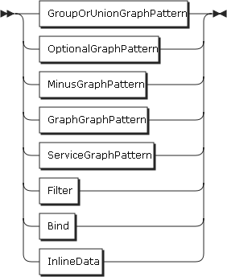 <map name="GraphPatternNotTriples.map"><area shape="rect" coords="49,1,197,33" href="#OptionalGraphPattern" title="OptionalGraphPattern"> <area shape="rect" coords="49,45,233,77" href="#GroupOrUnionGraphPattern" title="GroupOrUnionGraphPattern"> <area shape="rect" coords="49,89,183,121" href="#GraphGraphPattern" title="GraphGraphPattern"></map>

<div class="ebnf">

<pre>[GraphPatternNotTriples](#GraphPatternNotTriples "GraphPatternNotTriples")
         ::= [OptionalGraphPattern](#OptionalGraphPattern "OptionalGraphPattern")
           | [GroupOrUnionGraphPattern](#GroupOrUnionGraphPattern "GroupOrUnionGraphPattern")
           | [GraphGraphPattern](#GraphGraphPattern "GraphGraphPattern")</pre>

</div>

referenced by:

*   [GroupGraphPattern](#GroupGraphPattern "GroupGraphPattern")

<a name="OptionalGraphPattern">OptionalGraphPattern:</a>

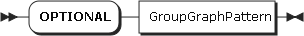 <map name="OptionalGraphPattern.map"><area shape="rect" coords="139,1,275,33" href="#GroupGraphPattern" title="GroupGraphPattern"></map>

<div class="ebnf">

<pre>[OptionalGraphPattern](#OptionalGraphPattern "OptionalGraphPattern")
         ::= 'OPTIONAL' [GroupGraphPattern](#GroupGraphPattern "GroupGraphPattern")</pre>

</div>

referenced by:

*   [GraphPatternNotTriples](#GraphPatternNotTriples "GraphPatternNotTriples")

<a name="GraphGraphPattern">GraphGraphPattern:</a>

 <map name="GraphGraphPattern.map"><area shape="rect" coords="115,1,201,33" href="#VarOrIRIref" title="VarOrIRIref"> <area shape="rect" coords="221,1,357,33" href="#GroupGraphPattern" title="GroupGraphPattern"></map>

<div class="ebnf">

<pre>[GraphGraphPattern](#GraphGraphPattern "GraphGraphPattern")
         ::= 'GRAPH' [VarOrIRIref](#VarOrIRIref "VarOrIRIref") [GroupGraphPattern](#GroupGraphPattern "GroupGraphPattern")</pre>

</div>

referenced by:

*   [GraphPatternNotTriples](#GraphPatternNotTriples "GraphPatternNotTriples")

<a name="GroupOrUnionGraphPattern">GroupOrUnionGraphPattern:</a>

 <map name="GroupOrUnionGraphPattern.map"><area shape="rect" coords="49,45,185,77" href="#GroupGraphPattern" title="GroupGraphPattern"></map>

<div class="ebnf">

<pre>[GroupOrUnionGraphPattern](#GroupOrUnionGraphPattern "GroupOrUnionGraphPattern")
         ::= [GroupGraphPattern](#GroupGraphPattern "GroupGraphPattern") ( 'UNION' [GroupGraphPattern](#GroupGraphPattern "GroupGraphPattern") )*</pre>

</div>

referenced by:

*   [GraphPatternNotTriples](#GraphPatternNotTriples "GraphPatternNotTriples")

<a name="Filter">Filter:</a>

 <map name="Filter.map"><area shape="rect" coords="117,1,199,33" href="#Constraint" title="Constraint"></map>

<div class="ebnf">

<pre>[Filter](#Filter "Filter")   ::= 'FILTER' [Constraint](#Constraint "Constraint")</pre>

</div>

referenced by:

*   [GroupGraphPattern](#GroupGraphPattern "GroupGraphPattern")

<a name="Constraint">Constraint:</a>

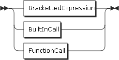 <map name="Constraint.map"><area shape="rect" coords="49,1,197,33" href="#BrackettedExpression" title="BrackettedExpression"> <area shape="rect" coords="49,45,125,77" href="#BuiltInCall" title="BuiltInCall"> <area shape="rect" coords="49,89,139,121" href="#FunctionCall" title="FunctionCall"></map>

<div class="ebnf">

<pre>[Constraint](#Constraint "Constraint")
         ::= [BrackettedExpression](#BrackettedExpression "BrackettedExpression")
           | [BuiltInCall](#BuiltInCall "BuiltInCall")
           | [FunctionCall](#FunctionCall "FunctionCall")</pre>

</div>

referenced by:

*   [Filter](#Filter "Filter")
*   [OrderCondition](#OrderCondition "OrderCondition")

<a name="FunctionCall">FunctionCall:</a>

 <map name="FunctionCall.map"><area shape="rect" coords="29,1,81,33" href="#IRIref" title="IRIref"> <area shape="rect" coords="101,1,161,33" href="#ArgList" title="ArgList"></map>

<div class="ebnf">

<pre>[FunctionCall](#FunctionCall "FunctionCall")
         ::= [IRIref](#IRIref "IRIref") [ArgList](#ArgList "ArgList")</pre>

</div>

referenced by:

*   [Constraint](#Constraint "Constraint")

<a name="ArgList">ArgList:</a>

 <map name="ArgList.map"><area shape="rect" coords="49,1,87,33" href="#NIL" title="NIL"> <area shape="rect" coords="115,89,199,121" href="#Expression" title="Expression"></map>

<div class="ebnf">

<pre>[ArgList](#ArgList "ArgList")  ::= [NIL](#NIL "NIL")
           | '(' [Expression](#Expression "Expression") ( ',' [Expression](#Expression "Expression") )* ')'</pre>

</div>

referenced by:

*   [FunctionCall](#FunctionCall "FunctionCall")
*   [IRIrefOrFunction](#IRIrefOrFunction "IRIrefOrFunction")

<a name="ConstructTemplate">ConstructTemplate:</a>

 <map name="ConstructTemplate.map"><area shape="rect" coords="97,33,211,65" href="#ConstructTriples" title="ConstructTriples"></map>

<div class="ebnf">

<pre>[ConstructTemplate](#ConstructTemplate "ConstructTemplate")
         ::= '{' [ConstructTriples](#ConstructTriples "ConstructTriples")? '}'</pre>

</div>

referenced by:

*   [ConstructQuery](#ConstructQuery "ConstructQuery")

<a name="ConstructTriples">ConstructTriples:</a>

 <map name="ConstructTriples.map"><area shape="rect" coords="29,1,165,33" href="#TriplesSameSubject" title="TriplesSameSubject"> <area shape="rect" coords="269,65,383,97" href="#ConstructTriples" title="ConstructTriples"></map>

<div class="ebnf">

<pre>[ConstructTriples](#ConstructTriples "ConstructTriples")
         ::= [TriplesSameSubject](#TriplesSameSubject "TriplesSameSubject") ( '.' [ConstructTriples](#ConstructTriples "ConstructTriples")? )?</pre>

</div>

referenced by:

*   [ConstructTemplate](#ConstructTemplate "ConstructTemplate")
*   [ConstructTriples](#ConstructTriples "ConstructTriples")

<a name="TriplesSameSubject">TriplesSameSubject:</a>

 <map name="TriplesSameSubject.map"><area shape="rect" coords="49,1,133,33" href="#VarOrTerm" title="VarOrTerm"> <area shape="rect" coords="153,1,303,33" href="#PropertyListNotEmpty" title="PropertyListNotEmpty"> <area shape="rect" coords="49,45,137,77" href="#TriplesNode" title="TriplesNode"> <area shape="rect" coords="157,45,247,77" href="#PropertyList" title="PropertyList"></map>

<div class="ebnf">

<pre>[TriplesSameSubject](#TriplesSameSubject "TriplesSameSubject")
         ::= [VarOrTerm](#VarOrTerm "VarOrTerm") [PropertyListNotEmpty](#PropertyListNotEmpty "PropertyListNotEmpty")
           | [TriplesNode](#TriplesNode "TriplesNode") [PropertyList](#PropertyList "PropertyList")</pre>

</div>

referenced by:

*   [ConstructTriples](#ConstructTriples "ConstructTriples")
*   [TriplesBlock](#TriplesBlock "TriplesBlock")

<a name="PropertyListNotEmpty">PropertyListNotEmpty:</a>

 <map name="PropertyListNotEmpty.map"><area shape="rect" coords="29,17,75,49" href="#Verb" title="Verb"> <area shape="rect" coords="95,17,173,49" href="#ObjectList" title="ObjectList"> <area shape="rect" coords="297,49,343,81" href="#Verb" title="Verb"> <area shape="rect" coords="363,49,441,81" href="#ObjectList" title="ObjectList"></map>

<div class="ebnf">

<pre>[PropertyListNotEmpty](#PropertyListNotEmpty "PropertyListNotEmpty")
         ::= [Verb](#Verb "Verb") [ObjectList](#ObjectList "ObjectList") ( ';' ( [Verb](#Verb "Verb") [ObjectList](#ObjectList "ObjectList") )? )*</pre>

</div>

referenced by:

*   [BlankNodePropertyList](#BlankNodePropertyList "BlankNodePropertyList")
*   [PropertyList](#PropertyList "PropertyList")
*   [TriplesSameSubject](#TriplesSameSubject "TriplesSameSubject")

<a name="PropertyList">PropertyList:</a>

 <map name="PropertyList.map"><area shape="rect" coords="49,21,199,53" href="#PropertyListNotEmpty" title="PropertyListNotEmpty"></map>

<div class="ebnf">

<pre>[PropertyList](#PropertyList "PropertyList")
         ::= [PropertyListNotEmpty](#PropertyListNotEmpty "PropertyListNotEmpty")?</pre>

</div>

referenced by:

*   [TriplesSameSubject](#TriplesSameSubject "TriplesSameSubject")

<a name="ObjectList">ObjectList:</a>

 <map name="ObjectList.map"><area shape="rect" coords="49,45,107,77" href="#Object" title="Object"></map>

<div class="ebnf">

<pre>[ObjectList](#ObjectList "ObjectList")
         ::= [Object](#Object "Object") ( ',' [Object](#Object "Object") )*</pre>

</div>

referenced by:

*   [PropertyListNotEmpty](#PropertyListNotEmpty "PropertyListNotEmpty")

<a name="Object">Object:</a>

 <map name="Object.map"><area shape="rect" coords="29,1,115,33" href="#GraphNode" title="GraphNode"></map>

<div class="ebnf">

<pre>[Object](#Object "Object")   ::= [GraphNode](#GraphNode "GraphNode")</pre>

</div>

referenced by:

*   [ObjectList](#ObjectList "ObjectList")

<a name="Verb">Verb:</a>

 <map name="Verb.map"><area shape="rect" coords="49,1,135,33" href="#VarOrIRIref" title="VarOrIRIref"></map>

<div class="ebnf">

<pre>[Verb](#Verb "Verb")     ::= [VarOrIRIref](#VarOrIRIref "VarOrIRIref")
           | 'a'</pre>

</div>

referenced by:

*   [PropertyListNotEmpty](#PropertyListNotEmpty "PropertyListNotEmpty")

<a name="TriplesNode">TriplesNode:</a>

 <map name="TriplesNode.map"><area shape="rect" coords="49,1,127,33" href="#Collection" title="Collection"> <area shape="rect" coords="49,45,203,77" href="#BlankNodePropertyList" title="BlankNodePropertyList"></map>

<div class="ebnf">

<pre>[TriplesNode](#TriplesNode "TriplesNode")
         ::= [Collection](#Collection "Collection")
           | [BlankNodePropertyList](#BlankNodePropertyList "BlankNodePropertyList")</pre>

</div>

referenced by:

*   [GraphNode](#GraphNode "GraphNode")
*   [TriplesSameSubject](#TriplesSameSubject "TriplesSameSubject")

<a name="BlankNodePropertyList">BlankNodePropertyList:</a>

 <map name="BlankNodePropertyList.map"><area shape="rect" coords="75,1,225,33" href="#PropertyListNotEmpty" title="PropertyListNotEmpty"></map>

<div class="ebnf">

<pre>[BlankNodePropertyList](#BlankNodePropertyList "BlankNodePropertyList")
         ::= '[' [PropertyListNotEmpty](#PropertyListNotEmpty "PropertyListNotEmpty") ']'</pre>

</div>

referenced by:

*   [TriplesNode](#TriplesNode "TriplesNode")

<a name="Collection">Collection:</a>

 <map name="Collection.map"><area shape="rect" coords="95,17,181,49" href="#GraphNode" title="GraphNode"></map>

<div class="ebnf">

<pre>[Collection](#Collection "Collection")
         ::= '(' [GraphNode](#GraphNode "GraphNode")+ ')'</pre>

</div>

referenced by:

*   [TriplesNode](#TriplesNode "TriplesNode")

<a name="GraphNode">GraphNode:</a>

 <map name="GraphNode.map"><area shape="rect" coords="49,1,133,33" href="#VarOrTerm" title="VarOrTerm"> <area shape="rect" coords="49,45,137,77" href="#TriplesNode" title="TriplesNode"></map>

<div class="ebnf">

<pre>[GraphNode](#GraphNode "GraphNode")
         ::= [VarOrTerm](#VarOrTerm "VarOrTerm")
           | [TriplesNode](#TriplesNode "TriplesNode")</pre>

</div>

referenced by:

*   [Collection](#Collection "Collection")
*   [Object](#Object "Object")

<a name="VarOrTerm">VarOrTerm:</a>

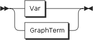 <map name="VarOrTerm.map"><area shape="rect" coords="49,1,89,33" href="#Var" title="Var"> <area shape="rect" coords="49,45,135,77" href="#GraphTerm" title="GraphTerm"></map>

<div class="ebnf">

<pre>[VarOrTerm](#VarOrTerm "VarOrTerm")
         ::= [Var](#Var "Var")
           | [GraphTerm](#GraphTerm "GraphTerm")</pre>

</div>

referenced by:

*   [GraphNode](#GraphNode "GraphNode")
*   [TriplesSameSubject](#TriplesSameSubject "TriplesSameSubject")

<a name="VarOrIRIref">VarOrIRIref:</a>

 <map name="VarOrIRIref.map"><area shape="rect" coords="49,1,89,33" href="#Var" title="Var"> <area shape="rect" coords="49,45,101,77" href="#IRIref" title="IRIref"></map>

<div class="ebnf">

<pre>[VarOrIRIref](#VarOrIRIref "VarOrIRIref")
         ::= [Var](#Var "Var")
           | [IRIref](#IRIref "IRIref")</pre>

</div>

referenced by:

*   [DescribeQuery](#DescribeQuery "DescribeQuery")
*   [GraphGraphPattern](#GraphGraphPattern "GraphGraphPattern")
*   [Verb](#Verb "Verb")

<a name="Var">Var:</a>

 <map name="Var.map"><area shape="rect" coords="49,1,101,33" href="#VAR1" title="VAR1"> <area shape="rect" coords="49,45,101,77" href="#VAR2" title="VAR2"></map>

<div class="ebnf">

<pre>[Var](#Var "Var")      ::= [VAR1](#VAR1 "VAR1")
           | [VAR2](#VAR2 "VAR2")</pre>

</div>

referenced by:

*   [BuiltInCall](#BuiltInCall "BuiltInCall")
*   [OrderCondition](#OrderCondition "OrderCondition")
*   [PrimaryExpression](#PrimaryExpression "PrimaryExpression")
*   [SelectQuery](#SelectQuery "SelectQuery")
*   [VarOrIRIref](#VarOrIRIref "VarOrIRIref")
*   [VarOrTerm](#VarOrTerm "VarOrTerm")

<a name="GraphTerm">GraphTerm:</a>

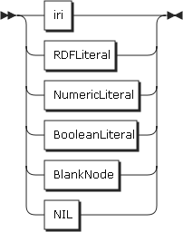 <map name="GraphTerm.map"><area shape="rect" coords="49,1,101,33" href="#IRIref" title="IRIref"> <area shape="rect" coords="49,45,127,77" href="#RDFLiteral" title="RDFLiteral"> <area shape="rect" coords="49,89,153,121" href="#NumericLiteral" title="NumericLiteral"> <area shape="rect" coords="49,133,151,165" href="#BooleanLiteral" title="BooleanLiteral"> <area shape="rect" coords="49,177,131,209" href="#BlankNode" title="BlankNode"> <area shape="rect" coords="49,221,87,253" href="#NIL" title="NIL"></map>

<div class="ebnf">

<pre>[GraphTerm](#GraphTerm "GraphTerm")
         ::= [IRIref](#IRIref "IRIref")
           | [RDFLiteral](#RDFLiteral "RDFLiteral")
           | [NumericLiteral](#NumericLiteral "NumericLiteral")
           | [BooleanLiteral](#BooleanLiteral "BooleanLiteral")
           | [BlankNode](#BlankNode "BlankNode")
           | [NIL](#NIL "NIL")</pre>

</div>

referenced by:

*   [VarOrTerm](#VarOrTerm "VarOrTerm")

<a name="Expression">Expression:</a>

 <map name="Expression.map"><area shape="rect" coords="29,1,193,33" href="#ConditionalOrExpression" title="ConditionalOrExpression"></map>

<div class="ebnf">

<pre>[Expression](#Expression "Expression")
         ::= [ConditionalOrExpression](#ConditionalOrExpression "ConditionalOrExpression")</pre>

</div>

referenced by:

*   [ArgList](#ArgList "ArgList")
*   [BrackettedExpression](#BrackettedExpression "BrackettedExpression")
*   [BuiltInCall](#BuiltInCall "BuiltInCall")
*   [RegexExpression](#RegexExpression "RegexExpression")

<a name="ConditionalOrExpression">ConditionalOrExpression:</a>

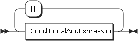 <map name="ConditionalOrExpression.map"><area shape="rect" coords="49,45,221,77" href="#ConditionalAndExpression" title="ConditionalAndExpression"></map>

<div class="ebnf">

<pre>[ConditionalOrExpression](#ConditionalOrExpression "ConditionalOrExpression")
         ::= [ConditionalAndExpression](#ConditionalAndExpression "ConditionalAndExpression") ( '||' [ConditionalAndExpression](#ConditionalAndExpression "ConditionalAndExpression") )*</pre>

</div>

referenced by:

*   [Expression](#Expression "Expression")

<a name="ConditionalAndExpression">ConditionalAndExpression:</a>

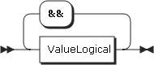 <map name="ConditionalAndExpression.map"><area shape="rect" coords="49,45,141,77" href="#ValueLogical" title="ValueLogical"></map>

<div class="ebnf">

<pre>[ConditionalAndExpression](#ConditionalAndExpression "ConditionalAndExpression")
         ::= [ValueLogical](#ValueLogical "ValueLogical") ( '&&' [ValueLogical](#ValueLogical "ValueLogical") )*</pre>

</div>

referenced by:

*   [ConditionalOrExpression](#ConditionalOrExpression "ConditionalOrExpression")

<a name="ValueLogical">ValueLogical:</a>

 <map name="ValueLogical.map"><area shape="rect" coords="29,1,169,33" href="#RelationalExpression" title="RelationalExpression"></map>

<div class="ebnf">

<pre>[ValueLogical](#ValueLogical "ValueLogical")
         ::= [RelationalExpression](#RelationalExpression "RelationalExpression")</pre>

</div>

referenced by:

*   [ConditionalAndExpression](#ConditionalAndExpression "ConditionalAndExpression")

<a name="RelationalExpression">RelationalExpression:</a>

 <map name="RelationalExpression.map"><area shape="rect" coords="29,1,161,33" href="#NumericExpression" title="NumericExpression"> <area shape="rect" coords="251,33,383,65" href="#NumericExpression" title="NumericExpression"> <area shape="rect" coords="255,77,387,109" href="#NumericExpression" title="NumericExpression"> <area shape="rect" coords="251,121,383,153" href="#NumericExpression" title="NumericExpression"> <area shape="rect" coords="251,165,383,197" href="#NumericExpression" title="NumericExpression"> <area shape="rect" coords="261,209,393,241" href="#NumericExpression" title="NumericExpression"> <area shape="rect" coords="261,253,393,285" href="#NumericExpression" title="NumericExpression"></map>

<div class="ebnf">

<pre>[RelationalExpression](#RelationalExpression "RelationalExpression")
         ::= [NumericExpression](#NumericExpression "NumericExpression") ( '=' [NumericExpression](#NumericExpression "NumericExpression") | '!=' [NumericExpression](#NumericExpression "NumericExpression") | '<' [NumericExpression](#NumericExpression "NumericExpression") | '>' [NumericExpression](#NumericExpression "NumericExpression") | '<=' [NumericExpression](#NumericExpression "NumericExpression") | '>=' [NumericExpression](#NumericExpression "NumericExpression") )?</pre>

</div>

referenced by:

*   [ValueLogical](#ValueLogical "ValueLogical")

<a name="NumericExpression">NumericExpression:</a>

 <map name="NumericExpression.map"><area shape="rect" coords="29,1,159,33" href="#AdditiveExpression" title="AdditiveExpression"></map>

<div class="ebnf">

<pre>[NumericExpression](#NumericExpression "NumericExpression")
         ::= [AdditiveExpression](#AdditiveExpression "AdditiveExpression")</pre>

</div>

referenced by:

*   [RelationalExpression](#RelationalExpression "RelationalExpression")

<a name="AdditiveExpression">AdditiveExpression:</a>

 <map name="AdditiveExpression.map"><area shape="rect" coords="29,17,187,49" href="#MultiplicativeExpression" title="MultiplicativeExpression"> <area shape="rect" coords="317,17,475,49" href="#MultiplicativeExpression" title="MultiplicativeExpression"> <area shape="rect" coords="313,61,471,93" href="#MultiplicativeExpression" title="MultiplicativeExpression"> <area shape="rect" coords="267,105,417,137" href="#NumericLiteralPositive" title="NumericLiteralPositive"> <area shape="rect" coords="267,149,423,181" href="#NumericLiteralNegative" title="NumericLiteralNegative"></map>

<div class="ebnf">

<pre>[AdditiveExpression](#AdditiveExpression "AdditiveExpression")
         ::= [MultiplicativeExpression](#MultiplicativeExpression "MultiplicativeExpression") ( '+' [MultiplicativeExpression](#MultiplicativeExpression "MultiplicativeExpression") | '-' [MultiplicativeExpression](#MultiplicativeExpression "MultiplicativeExpression") | [NumericLiteralPositive](#NumericLiteralPositive "NumericLiteralPositive") | [NumericLiteralNegative](#NumericLiteralNegative "NumericLiteralNegative") )*</pre>

</div>

referenced by:

*   [NumericExpression](#NumericExpression "NumericExpression")

<a name="MultiplicativeExpression">MultiplicativeExpression:</a>

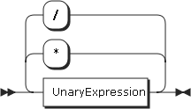 <map name="MultiplicativeExpression.map"><area shape="rect" coords="29,17,147,49" href="#UnaryExpression" title="UnaryExpression"> <area shape="rect" coords="275,17,393,49" href="#UnaryExpression" title="UnaryExpression"> <area shape="rect" coords="275,61,393,93" href="#UnaryExpression" title="UnaryExpression"></map>

<div class="ebnf">

<pre>[MultiplicativeExpression](#MultiplicativeExpression "MultiplicativeExpression")
         ::= [UnaryExpression](#UnaryExpression "UnaryExpression") ( '*' [UnaryExpression](#UnaryExpression "UnaryExpression") | '/' [UnaryExpression](#UnaryExpression "UnaryExpression") )*</pre>

</div>

referenced by:

*   [AdditiveExpression](#AdditiveExpression "AdditiveExpression")

<a name="UnaryExpression">UnaryExpression:</a>

 <map name="UnaryExpression.map"><area shape="rect" coords="93,1,223,33" href="#PrimaryExpression" title="PrimaryExpression"> <area shape="rect" coords="99,45,229,77" href="#PrimaryExpression" title="PrimaryExpression"> <area shape="rect" coords="95,89,225,121" href="#PrimaryExpression" title="PrimaryExpression"> <area shape="rect" coords="49,133,179,165" href="#PrimaryExpression" title="PrimaryExpression"></map>

<div class="ebnf">

<pre>[UnaryExpression](#UnaryExpression "UnaryExpression")
         ::= '!' [PrimaryExpression](#PrimaryExpression "PrimaryExpression")
           | '+' [PrimaryExpression](#PrimaryExpression "PrimaryExpression")
           | '-' [PrimaryExpression](#PrimaryExpression "PrimaryExpression")
           | [PrimaryExpression](#PrimaryExpression "PrimaryExpression")</pre>

</div>

referenced by:

*   [MultiplicativeExpression](#MultiplicativeExpression "MultiplicativeExpression")

<a name="PrimaryExpression">PrimaryExpression:</a>

 <map name="PrimaryExpression.map"><area shape="rect" coords="49,1,197,33" href="#BrackettedExpression" title="BrackettedExpression"> <area shape="rect" coords="49,45,125,77" href="#BuiltInCall" title="BuiltInCall"> <area shape="rect" coords="49,89,165,121" href="#IRIrefOrFunction" title="IRIrefOrFunction"> <area shape="rect" coords="49,133,127,165" href="#RDFLiteral" title="RDFLiteral"> <area shape="rect" coords="49,177,153,209" href="#NumericLiteral" title="NumericLiteral"> <area shape="rect" coords="49,221,151,253" href="#BooleanLiteral" title="BooleanLiteral"> <area shape="rect" coords="49,265,89,297" href="#Var" title="Var"></map>

<div class="ebnf">

<pre>[PrimaryExpression](#PrimaryExpression "PrimaryExpression")
         ::= [BrackettedExpression](#BrackettedExpression "BrackettedExpression")
           | [BuiltInCall](#BuiltInCall "BuiltInCall")
           | [IRIrefOrFunction](#IRIrefOrFunction "IRIrefOrFunction")
           | [RDFLiteral](#RDFLiteral "RDFLiteral")
           | [NumericLiteral](#NumericLiteral "NumericLiteral")
           | [BooleanLiteral](#BooleanLiteral "BooleanLiteral")
           | [Var](#Var "Var")</pre>

</div>

referenced by:

*   [UnaryExpression](#UnaryExpression "UnaryExpression")

<a name="BrackettedExpression">BrackettedExpression:</a>

 <map name="BrackettedExpression.map"><area shape="rect" coords="75,1,159,33" href="#Expression" title="Expression"></map>

<div class="ebnf">

<pre>[BrackettedExpression](#BrackettedExpression "BrackettedExpression")
         ::= '(' [Expression](#Expression "Expression") ')'</pre>

</div>

referenced by:

*   [Constraint](#Constraint "Constraint")
*   [OrderCondition](#OrderCondition "OrderCondition")
*   [PrimaryExpression](#PrimaryExpression "PrimaryExpression")

<a name="BuiltInCall">BuiltInCall:</a>

 <map name="BuiltInCall.map"><area shape="rect" coords="161,1,245,33" href="#Expression" title="Expression"> <area shape="rect" coords="171,45,255,77" href="#Expression" title="Expression"> <area shape="rect" coords="235,89,319,121" href="#Expression" title="Expression"> <area shape="rect" coords="383,89,467,121" href="#Expression" title="Expression"> <area shape="rect" coords="205,133,289,165" href="#Expression" title="Expression"> <area shape="rect" coords="183,177,223,209" href="#Var" title="Var"> <area shape="rect" coords="205,221,289,253" href="#Expression" title="Expression"> <area shape="rect" coords="353,221,437,253" href="#Expression" title="Expression"> <area shape="rect" coords="167,265,251,297" href="#Expression" title="Expression"> <area shape="rect" coords="171,309,255,341" href="#Expression" title="Expression"> <area shape="rect" coords="191,353,275,385" href="#Expression" title="Expression"> <area shape="rect" coords="203,397,287,429" href="#Expression" title="Expression"> <area shape="rect" coords="49,441,169,473" href="#RegexExpression" title="RegexExpression"></map>

<div class="ebnf">

<pre>[BuiltInCall](#BuiltInCall "BuiltInCall")
         ::= 'STR' '(' [Expression](#Expression "Expression") ')'
           | 'LANG' '(' [Expression](#Expression "Expression") ')'
           | 'LANGMATCHES' '(' [Expression](#Expression "Expression") ',' [Expression](#Expression "Expression") ')'
           | 'DATATYPE' '(' [Expression](#Expression "Expression") ')'
           | 'BOUND' '(' [Var](#Var "Var") ')'
           | 'sameTerm' '(' [Expression](#Expression "Expression") ',' [Expression](#Expression "Expression") ')'
           | 'isIRI' '(' [Expression](#Expression "Expression") ')'
           | 'isURI' '(' [Expression](#Expression "Expression") ')'
           | 'isBLANK' '(' [Expression](#Expression "Expression") ')'
           | 'isLITERAL' '(' [Expression](#Expression "Expression") ')'
           | [RegexExpression](#RegexExpression "RegexExpression")</pre>

</div>

referenced by:

*   [Constraint](#Constraint "Constraint")
*   [PrimaryExpression](#PrimaryExpression "PrimaryExpression")

<a name="RegexExpression">RegexExpression:</a>

 <map name="RegexExpression.map"><area shape="rect" coords="159,1,243,33" href="#Expression" title="Expression"> <area shape="rect" coords="307,1,391,33" href="#Expression" title="Expression"> <area shape="rect" coords="475,33,559,65" href="#Expression" title="Expression"></map>

<div class="ebnf">

<pre>[RegexExpression](#RegexExpression "RegexExpression")
         ::= 'REGEX' '(' [Expression](#Expression "Expression") ',' [Expression](#Expression "Expression") ( ',' [Expression](#Expression "Expression") )? ')'</pre>

</div>

referenced by:

*   [BuiltInCall](#BuiltInCall "BuiltInCall")

<a name="IRIrefOrFunction">IRIrefOrFunction:</a>

 <map name="IRIrefOrFunction.map"><area shape="rect" coords="29,1,81,33" href="#IRIref" title="IRIref"> <area shape="rect" coords="121,33,181,65" href="#ArgList" title="ArgList"></map>

<div class="ebnf">

<pre>[IRIrefOrFunction](#IRIrefOrFunction "IRIrefOrFunction")
         ::= [IRIref](#IRIref "IRIref") [ArgList](#ArgList "ArgList")?</pre>

</div>

referenced by:

*   [PrimaryExpression](#PrimaryExpression "PrimaryExpression")

<a name="RDFLiteral">RDFLiteral:</a>

 <map name="RDFLiteral.map"><area shape="rect" coords="29,1,83,33" href="#String" title="String"> <area shape="rect" coords="123,33,199,65" href="#LANGTAG" title="LANGTAG"> <area shape="rect" coords="183,77,235,109" href="#IRIref" title="IRIref"></map>

<div class="ebnf">

<pre>[RDFLiteral](#RDFLiteral "RDFLiteral")
         ::= [String](#String "String") ( [LANGTAG](#LANGTAG "LANGTAG") | '^^' [IRIref](#IRIref "IRIref") )?</pre>

</div>

referenced by:

*   [GraphTerm](#GraphTerm "GraphTerm")
*   [PrimaryExpression](#PrimaryExpression "PrimaryExpression")

<a name="NumericLiteral">NumericLiteral:</a>

 <map name="NumericLiteral.map"><area shape="rect" coords="49,1,207,33" href="#NumericLiteralUnsigned" title="NumericLiteralUnsigned"> <area shape="rect" coords="49,45,199,77" href="#NumericLiteralPositive" title="NumericLiteralPositive"> <area shape="rect" coords="49,89,205,121" href="#NumericLiteralNegative" title="NumericLiteralNegative"></map>

<div class="ebnf">

<pre>[NumericLiteral](#NumericLiteral "NumericLiteral")
         ::= [NumericLiteralUnsigned](#NumericLiteralUnsigned "NumericLiteralUnsigned")
           | [NumericLiteralPositive](#NumericLiteralPositive "NumericLiteralPositive")
           | [NumericLiteralNegative](#NumericLiteralNegative "NumericLiteralNegative")</pre>

</div>

referenced by:

*   [GraphTerm](#GraphTerm "GraphTerm")
*   [PrimaryExpression](#PrimaryExpression "PrimaryExpression")

<a name="NumericLiteralUnsigned">NumericLiteralUnsigned:</a>

 <map name="NumericLiteralUnsigned.map"><area shape="rect" coords="49,1,119,33" href="#INTEGER" title="INTEGER"> <area shape="rect" coords="49,45,123,77" href="#DECIMAL" title="DECIMAL"> <area shape="rect" coords="49,89,117,121" href="#DOUBLE" title="DOUBLE"></map>

<div class="ebnf">

<pre>[NumericLiteralUnsigned](#NumericLiteralUnsigned "NumericLiteralUnsigned")
         ::= [INTEGER](#INTEGER "INTEGER")
           | [DECIMAL](#DECIMAL "DECIMAL")
           | [DOUBLE](#DOUBLE "DOUBLE")</pre>

</div>

referenced by:

*   [NumericLiteral](#NumericLiteral "NumericLiteral")

<a name="NumericLiteralPositive">NumericLiteralPositive:</a>

 <map name="NumericLiteralPositive.map"><area shape="rect" coords="49,1,183,33" href="#INTEGER_POSITIVE" title="INTEGER_POSITIVE"> <area shape="rect" coords="49,45,185,77" href="#DECIMAL_POSITIVE" title="DECIMAL_POSITIVE"> <area shape="rect" coords="49,89,179,121" href="#DOUBLE_POSITIVE" title="DOUBLE_POSITIVE"></map>

<div class="ebnf">

<pre>[NumericLiteralPositive](#NumericLiteralPositive "NumericLiteralPositive")
         ::= [INTEGER_POSITIVE](#INTEGER_POSITIVE "INTEGER_POSITIVE")
           | [DECIMAL_POSITIVE](#DECIMAL_POSITIVE "DECIMAL_POSITIVE")
           | [DOUBLE_POSITIVE](#DOUBLE_POSITIVE "DOUBLE_POSITIVE")</pre>

</div>

referenced by:

*   [AdditiveExpression](#AdditiveExpression "AdditiveExpression")
*   [NumericLiteral](#NumericLiteral "NumericLiteral")

<a name="NumericLiteralNegative">NumericLiteralNegative:</a>

 <map name="NumericLiteralNegative.map"><area shape="rect" coords="49,1,187,33" href="#INTEGER_NEGATIVE" title="INTEGER_NEGATIVE"> <area shape="rect" coords="49,45,189,77" href="#DECIMAL_NEGATIVE" title="DECIMAL_NEGATIVE"> <area shape="rect" coords="49,89,185,121" href="#DOUBLE_NEGATIVE" title="DOUBLE_NEGATIVE"></map>

<div class="ebnf">

<pre>[NumericLiteralNegative](#NumericLiteralNegative "NumericLiteralNegative")
         ::= [INTEGER_NEGATIVE](#INTEGER_NEGATIVE "INTEGER_NEGATIVE")
           | [DECIMAL_NEGATIVE](#DECIMAL_NEGATIVE "DECIMAL_NEGATIVE")
           | [DOUBLE_NEGATIVE](#DOUBLE_NEGATIVE "DOUBLE_NEGATIVE")</pre>

</div>

referenced by:

*   [AdditiveExpression](#AdditiveExpression "AdditiveExpression")
*   [NumericLiteral](#NumericLiteral "NumericLiteral")

<a name="BooleanLiteral">BooleanLiteral:</a>

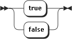

<div class="ebnf">

<pre>[BooleanLiteral](#BooleanLiteral "BooleanLiteral")
         ::= 'true'
           | 'false'</pre>

</div>

referenced by:

*   [GraphTerm](#GraphTerm "GraphTerm")
*   [PrimaryExpression](#PrimaryExpression "PrimaryExpression")

<a name="String">String:</a>

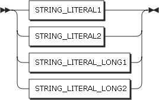 <map name="String.map"><area shape="rect" coords="49,1,175,33" href="#STRING_LITERAL1" title="STRING_LITERAL1"> <area shape="rect" coords="49,45,175,77" href="#STRING_LITERAL2" title="STRING_LITERAL2"> <area shape="rect" coords="49,89,219,121" href="#STRING_LITERAL_LONG1" title="STRING_LITERAL_LONG1"> <area shape="rect" coords="49,133,219,165" href="#STRING_LITERAL_LONG2" title="STRING_LITERAL_LONG2"></map>

<div class="ebnf">

<pre>[String](#String "String")   ::= [STRING_LITERAL1](#STRING_LITERAL1 "STRING_LITERAL1")
           | [STRING_LITERAL2](#STRING_LITERAL2 "STRING_LITERAL2")
           | [STRING_LITERAL_LONG1](#STRING_LITERAL_LONG1 "STRING_LITERAL_LONG1")
           | [STRING_LITERAL_LONG2](#STRING_LITERAL_LONG2 "STRING_LITERAL_LONG2")</pre>

</div>

referenced by:

*   [RDFLiteral](#RDFLiteral "RDFLiteral")

<a name="IRIref">IRIref:</a>

 <map name="IRIref.map"><area shape="rect" coords="49,1,115,33" href="#IRI_REF" title="IRI_REF"> <area shape="rect" coords="49,45,151,77" href="#PrefixedName" title="PrefixedName"></map>

<div class="ebnf">

<pre>[IRIref](#IRIref "IRIref")   ::= [IRI_REF](#IRI_REF "IRI_REF")
           | [PrefixedName](#PrefixedName "PrefixedName")</pre>

</div>

referenced by:

*   [FunctionCall](#FunctionCall "FunctionCall")
*   [GraphTerm](#GraphTerm "GraphTerm")
*   [IRIrefOrFunction](#IRIrefOrFunction "IRIrefOrFunction")
*   [RDFLiteral](#RDFLiteral "RDFLiteral")
*   [SourceSelector](#SourceSelector "SourceSelector")
*   [VarOrIRIref](#VarOrIRIref "VarOrIRIref")

<a name="PrefixedName">PrefixedName:</a>

 <map name="PrefixedName.map"><area shape="rect" coords="49,1,133,33" href="#PNAME_LN" title="PNAME_LN"> <area shape="rect" coords="49,45,135,77" href="#PNAME_NS" title="PNAME_NS"></map>

<div class="ebnf">

<pre>[PrefixedName](#PrefixedName "PrefixedName")
         ::= [PNAME_LN](#PNAME_LN "PNAME_LN")
           | [PNAME_NS](#PNAME_NS "PNAME_NS")</pre>

</div>

referenced by:

*   [IRIref](#IRIref "IRIref")

<a name="BlankNode">BlankNode:</a>

 <map name="BlankNode.map"><area shape="rect" coords="49,1,195,33" href="#BLANK_NODE_LABEL" title="BLANK_NODE_LABEL"> <area shape="rect" coords="49,45,103,77" href="#ANON" title="ANON"></map>

<div class="ebnf">

<pre>[BlankNode](#BlankNode "BlankNode")
         ::= [BLANK_NODE_LABEL](#BLANK_NODE_LABEL "BLANK_NODE_LABEL")
           | [ANON](#ANON "ANON")</pre>

</div>

referenced by:

*   [GraphTerm](#GraphTerm "GraphTerm")

<a name="IRI_REF">IRI_REF:</a>


<div class="ebnf">

<pre>[IRI_REF](#IRI_REF "IRI_REF")  ::= '<' ( [^<>"{}|^`\] - [#x0000-#x0020] )* '>'</pre>

</div>

referenced by:

*   [BaseDecl](#BaseDecl "BaseDecl")
*   [IRIref](#IRIref "IRIref")
*   [PrefixDecl](#PrefixDecl "PrefixDecl")

<a name="PNAME_NS">PNAME_NS:</a>

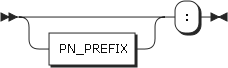 <map name="PNAME_NS.map"><area shape="rect" coords="49,33,135,65" href="#PN_PREFIX" title="PN_PREFIX"></map>

<div class="ebnf">

<pre>[PNAME_NS](#PNAME_NS "PNAME_NS") ::= [PN_PREFIX](#PN_PREFIX "PN_PREFIX")? ':'</pre>

</div>

referenced by:

*   [PNAME_LN](#PNAME_LN "PNAME_LN")
*   [PrefixDecl](#PrefixDecl "PrefixDecl")
*   [PrefixedName](#PrefixedName "PrefixedName")

<a name="PNAME_LN">PNAME_LN:</a>

 <map name="PNAME_LN.map"><area shape="rect" coords="29,1,115,33" href="#PNAME_NS" title="PNAME_NS"> <area shape="rect" coords="135,1,217,33" href="#PN_LOCAL" title="PN_LOCAL"></map>

<div class="ebnf">

<pre>[PNAME_LN](#PNAME_LN "PNAME_LN") ::= [PNAME_NS](#PNAME_NS "PNAME_NS") [PN_LOCAL](#PN_LOCAL "PN_LOCAL")</pre>

</div>

referenced by:

*   [PrefixedName](#PrefixedName "PrefixedName")

<a name="BLANK_NODE_LABEL">BLANK_NODE_LABEL:</a>

 <map name="BLANK_NODE_LABEL.map"><area shape="rect" coords="83,1,165,33" href="#PN_LOCAL" title="PN_LOCAL"></map>

<div class="ebnf">

<pre>[BLANK_NODE_LABEL](#BLANK_NODE_LABEL "BLANK_NODE_LABEL")
         ::= '_:' [PN_LOCAL](#PN_LOCAL "PN_LOCAL")</pre>

</div>

referenced by:

*   [BlankNode](#BlankNode "BlankNode")

<a name="VAR1">VAR1:</a>

 <map name="VAR1.map"><area shape="rect" coords="75,1,153,33" href="#VARNAME" title="VARNAME"></map>

<div class="ebnf">

<pre>[VAR1](#VAR1 "VAR1")     ::= '?' [VARNAME](#VARNAME "VARNAME")</pre>

</div>

referenced by:

*   [Var](#Var "Var")

<a name="VAR2">VAR2:</a>

 <map name="VAR2.map"><area shape="rect" coords="77,1,155,33" href="#VARNAME" title="VARNAME"></map>

<div class="ebnf">

<pre>[VAR2](#VAR2 "VAR2")     ::= '/pre> [VARNAME](#VARNAME "VARNAME")</pre>

</div>

referenced by:

*   [Var](#Var "Var")

<a name="LANGTAG">LANGTAG:</a>


<div class="ebnf">

<pre>[LANGTAG](#LANGTAG "LANGTAG")  ::= '@' [a-zA-Z]+ ( '-' [a-zA-Z0-9]+ )*</pre>

</div>

referenced by:

*   [RDFLiteral](#RDFLiteral "RDFLiteral")

<a name="INTEGER">INTEGER:</a>


<div class="ebnf">

<pre>[INTEGER](#INTEGER "INTEGER")  ::= [0-9]+</pre>

</div>

referenced by:

*   [INTEGER_NEGATIVE](#INTEGER_NEGATIVE "INTEGER_NEGATIVE")
*   [INTEGER_POSITIVE](#INTEGER_POSITIVE "INTEGER_POSITIVE")
*   [LimitClause](#LimitClause "LimitClause")
*   [NumericLiteralUnsigned](#NumericLiteralUnsigned "NumericLiteralUnsigned")
*   [OffsetClause](#OffsetClause "OffsetClause")

<a name="DECIMAL">DECIMAL:</a>

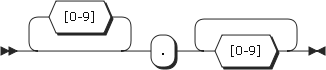

<div class="ebnf">

<pre>[DECIMAL](#DECIMAL "DECIMAL")  ::= [0-9]+ '.' [0-9]*
           | '.' [0-9]+</pre>

</div>

referenced by:

*   [DECIMAL_NEGATIVE](#DECIMAL_NEGATIVE "DECIMAL_NEGATIVE")
*   [DECIMAL_POSITIVE](#DECIMAL_POSITIVE "DECIMAL_POSITIVE")
*   [NumericLiteralUnsigned](#NumericLiteralUnsigned "NumericLiteralUnsigned")

<a name="DOUBLE">DOUBLE:</a>

 <map name="DOUBLE.map"><area shape="rect" coords="337,35,419,67" href="#EXPONENT" title="EXPONENT"> <area shape="rect" coords="215,101,297,133" href="#EXPONENT" title="EXPONENT"> <area shape="rect" coords="171,167,253,199" href="#EXPONENT" title="EXPONENT"></map>

<div class="ebnf">

<pre>[DOUBLE](#DOUBLE "DOUBLE")   ::= [0-9]+ '.' [0-9]* [EXPONENT](#EXPONENT "EXPONENT")
           | '.' [0-9]+ [EXPONENT](#EXPONENT "EXPONENT")
           | [0-9]+ [EXPONENT](#EXPONENT "EXPONENT")</pre>

</div>

referenced by:

*   [DOUBLE_NEGATIVE](#DOUBLE_NEGATIVE "DOUBLE_NEGATIVE")
*   [DOUBLE_POSITIVE](#DOUBLE_POSITIVE "DOUBLE_POSITIVE")
*   [NumericLiteralUnsigned](#NumericLiteralUnsigned "NumericLiteralUnsigned")

<a name="INTEGER_POSITIVE">INTEGER_POSITIVE:</a>

 <map name="INTEGER_POSITIVE.map"><area shape="rect" coords="79,1,149,33" href="#INTEGER" title="INTEGER"></map>

<div class="ebnf">

<pre>[INTEGER_POSITIVE](#INTEGER_POSITIVE "INTEGER_POSITIVE")
         ::= '+' [INTEGER](#INTEGER "INTEGER")</pre>

</div>

referenced by:

*   [NumericLiteralPositive](#NumericLiteralPositive "NumericLiteralPositive")

<a name="DECIMAL_POSITIVE">DECIMAL_POSITIVE:</a>

 <map name="DECIMAL_POSITIVE.map"><area shape="rect" coords="79,1,153,33" href="#DECIMAL" title="DECIMAL"></map>

<div class="ebnf">

<pre>[DECIMAL_POSITIVE](#DECIMAL_POSITIVE "DECIMAL_POSITIVE")
         ::= '+' [DECIMAL](#DECIMAL "DECIMAL")</pre>

</div>

referenced by:

*   [NumericLiteralPositive](#NumericLiteralPositive "NumericLiteralPositive")

<a name="DOUBLE_POSITIVE">DOUBLE_POSITIVE:</a>

 <map name="DOUBLE_POSITIVE.map"><area shape="rect" coords="79,1,147,33" href="#DOUBLE" title="DOUBLE"></map>

<div class="ebnf">

<pre>[DOUBLE_POSITIVE](#DOUBLE_POSITIVE "DOUBLE_POSITIVE")
         ::= '+' [DOUBLE](#DOUBLE "DOUBLE")</pre>

</div>

referenced by:

*   [NumericLiteralPositive](#NumericLiteralPositive "NumericLiteralPositive")

<a name="INTEGER_NEGATIVE">INTEGER_NEGATIVE:</a>

 <map name="INTEGER_NEGATIVE.map"><area shape="rect" coords="75,1,145,33" href="#INTEGER" title="INTEGER"></map>

<div class="ebnf">

<pre>[INTEGER_NEGATIVE](#INTEGER_NEGATIVE "INTEGER_NEGATIVE")
         ::= '-' [INTEGER](#INTEGER "INTEGER")</pre>

</div>

referenced by:

*   [NumericLiteralNegative](#NumericLiteralNegative "NumericLiteralNegative")

<a name="DECIMAL_NEGATIVE">DECIMAL_NEGATIVE:</a>

 <map name="DECIMAL_NEGATIVE.map"><area shape="rect" coords="75,1,149,33" href="#DECIMAL" title="DECIMAL"></map>

<div class="ebnf">

<pre>[DECIMAL_NEGATIVE](#DECIMAL_NEGATIVE "DECIMAL_NEGATIVE")
         ::= '-' [DECIMAL](#DECIMAL "DECIMAL")</pre>

</div>

referenced by:

*   [NumericLiteralNegative](#NumericLiteralNegative "NumericLiteralNegative")

<a name="DOUBLE_NEGATIVE">DOUBLE_NEGATIVE:</a>

 <map name="DOUBLE_NEGATIVE.map"><area shape="rect" coords="75,1,143,33" href="#DOUBLE" title="DOUBLE"></map>

<div class="ebnf">

<pre>[DOUBLE_NEGATIVE](#DOUBLE_NEGATIVE "DOUBLE_NEGATIVE")
         ::= '-' [DOUBLE](#DOUBLE "DOUBLE")</pre>

</div>

referenced by:

*   [NumericLiteralNegative](#NumericLiteralNegative "NumericLiteralNegative")

<a name="EXPONENT">EXPONENT:</a>

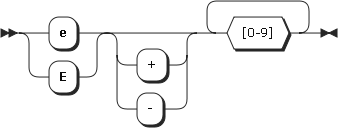

<div class="ebnf">

<pre>[EXPONENT](#EXPONENT "EXPONENT") ::= [eE] [+#x2D]? [0-9]+</pre>

</div>

referenced by:

*   [DOUBLE](#DOUBLE "DOUBLE")

<a name="STRING_LITERAL1">STRING_LITERAL1:</a>

 <map name="STRING_LITERAL1.map"><area shape="rect" coords="133,61,193,93" href="#ECHAR" title="ECHAR"></map>

<div class="ebnf">

<pre>[STRING_LITERAL1](#STRING_LITERAL1 "STRING_LITERAL1")
         ::= "'" ( [^#x0027#x005C#x000A#x000D] | [ECHAR](#ECHAR "ECHAR") )* "'"</pre>

</div>

referenced by:

*   [String](#String "String")

<a name="STRING_LITERAL2">STRING_LITERAL2:</a>

 <map name="STRING_LITERAL2.map"><area shape="rect" coords="135,61,195,93" href="#ECHAR" title="ECHAR"></map>

<div class="ebnf">

<pre>[STRING_LITERAL2](#STRING_LITERAL2 "STRING_LITERAL2")
         ::= '"' ( [^#x0022#x005C#x000A#x000D] | [ECHAR](#ECHAR "ECHAR") )* '"'</pre>

</div>

referenced by:

*   [String](#String "String")

<a name="STRING_LITERAL_LONG1">STRING_LITERAL_LONG1:</a>

 <map name="STRING_LITERAL_LONG1.map"><area shape="rect" coords="229,61,289,93" href="#ECHAR" title="ECHAR"></map>

<div class="ebnf">

<pre>[STRING_LITERAL_LONG1](#STRING_LITERAL_LONG1 "STRING_LITERAL_LONG1")
         ::= "'''" ( ( "'" | "''" )? ( [^'\] | [ECHAR](#ECHAR "ECHAR") ) )* "'''"</pre>

</div>

referenced by:

*   [String](#String "String")

<a name="STRING_LITERAL_LONG2">STRING_LITERAL_LONG2:</a>

 <map name="STRING_LITERAL_LONG2.map"><area shape="rect" coords="245,61,305,93" href="#ECHAR" title="ECHAR"></map>

<div class="ebnf">

<pre>[STRING_LITERAL_LONG2](#STRING_LITERAL_LONG2 "STRING_LITERAL_LONG2")
         ::= '"""' ( ( '"' | '""' )? ( [^"\] | [ECHAR](#ECHAR "ECHAR") ) )* '"""'</pre>

</div>

referenced by:

*   [String](#String "String")

<a name="ECHAR">ECHAR:</a>


<div class="ebnf">

<pre>[ECHAR](#ECHAR "ECHAR")    ::= '\' [tbnrf\"']</pre>

</div>

referenced by:

*   [STRING_LITERAL1](#STRING_LITERAL1 "STRING_LITERAL1")
*   [STRING_LITERAL2](#STRING_LITERAL2 "STRING_LITERAL2")
*   [STRING_LITERAL_LONG1](#STRING_LITERAL_LONG1 "STRING_LITERAL_LONG1")
*   [STRING_LITERAL_LONG2](#STRING_LITERAL_LONG2 "STRING_LITERAL_LONG2")

<a name="NIL">NIL:</a>

 <map name="NIL.map"><area shape="rect" coords="95,1,135,33" href="#WS" title="WS"></map>

<div class="ebnf">

<pre>[NIL](#NIL "NIL")      ::= '(' [WS](#WS "WS")* ')'</pre>

</div>

referenced by:

*   [ArgList](#ArgList "ArgList")
*   [GraphTerm](#GraphTerm "GraphTerm")

<a name="WS">WS:</a>

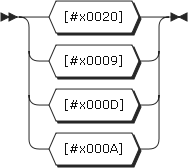

<div class="ebnf">

<pre>[WS](#WS "WS")       ::= #x0020
           | #x0009
           | #x000D
           | #x000A</pre>

</div>

referenced by:

*   [ANON](#ANON "ANON")
*   [NIL](#NIL "NIL")

<a name="ANON">ANON:</a>

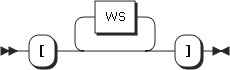 <map name="ANON.map"><area shape="rect" coords="95,1,135,33" href="#WS" title="WS"></map>

<div class="ebnf">

<pre>[ANON](#ANON "ANON")     ::= '[' [WS](#WS "WS")* ']'</pre>

</div>

referenced by:

*   [BlankNode](#BlankNode "BlankNode")

<a name="PN_CHARS_BASE">PN_CHARS_BASE:</a>


<div class="ebnf">

<pre>[PN_CHARS_BASE](#PN_CHARS_BASE "PN_CHARS_BASE")
         ::= [A-Z]
           | [a-z]
           | [#x00C0-#x00D6]
           | [#x00D8-#x00F6]
           | [#x00F8-#x02FF]
           | [#x0370-#x037D]
           | [#x037F-#x1FFF]
           | [#x200C-#x200D]
           | [#x2070-#x218F]
           | [#x2C00-#x2FEF]
           | [#x3001-#xD7FF]
           | [#xF900-#xFDCF]
           | [#xFDF0-#xFFFD]
           | [#x10000-#xEFFFF]</pre>

</div>

referenced by:

*   [PN_CHARS_U](#PN_CHARS_U "PN_CHARS_U")
*   [PN_PREFIX](#PN_PREFIX "PN_PREFIX")

<a name="PN_CHARS_U">PN_CHARS_U:</a>

 <map name="PN_CHARS_U.map"><area shape="rect" coords="49,1,173,33" href="#PN_CHARS_BASE" title="PN_CHARS_BASE"></map>

<div class="ebnf">

<pre>[PN_CHARS_U](#PN_CHARS_U "PN_CHARS_U")
         ::= [PN_CHARS_BASE](#PN_CHARS_BASE "PN_CHARS_BASE")
           | '_'</pre>

</div>

referenced by:

*   [PN_CHARS](#PN_CHARS "PN_CHARS")
*   [PN_LOCAL](#PN_LOCAL "PN_LOCAL")
*   [VARNAME](#VARNAME "VARNAME")

<a name="VARNAME">VARNAME:</a>

 <map name="VARNAME.map"><area shape="rect" coords="49,211,151,243" href="#PN_CHARS_U" title="PN_CHARS_U"> <area shape="rect" coords="211,177,313,209" href="#PN_CHARS_U" title="PN_CHARS_U"></map>

<div class="ebnf">

<pre>[VARNAME](#VARNAME "VARNAME")  ::= ( [PN_CHARS_U](#PN_CHARS_U "PN_CHARS_U") | [0-9] ) ( [PN_CHARS_U](#PN_CHARS_U "PN_CHARS_U") | [0-9] | #x00B7 | [#x0300-#x036F] | [#x203F-#x2040] )*</pre>

</div>

referenced by:

*   [VAR1](#VAR1 "VAR1")
*   [VAR2](#VAR2 "VAR2")

<a name="PN_CHARS">PN_CHARS:</a>

 <map name="PN_CHARS.map"><area shape="rect" coords="49,1,151,33" href="#PN_CHARS_U" title="PN_CHARS_U"></map>

<div class="ebnf">

<pre>[PN_CHARS](#PN_CHARS "PN_CHARS") ::= [PN_CHARS_U](#PN_CHARS_U "PN_CHARS_U")
           | '-'
           | [0-9]
           | #x00B7
           | [#x0300-#x036F]
           | [#x203F-#x2040]</pre>

</div>

referenced by:

*   [PN_LOCAL](#PN_LOCAL "PN_LOCAL")
*   [PN_PREFIX](#PN_PREFIX "PN_PREFIX")

<a name="PN_PREFIX">PN_PREFIX:</a>

 <map name="PN_PREFIX.map"><area shape="rect" coords="29,79,153,111" href="#PN_CHARS_BASE" title="PN_CHARS_BASE"> <area shape="rect" coords="213,45,299,77" href="#PN_CHARS" title="PN_CHARS"> <area shape="rect" coords="339,79,425,111" href="#PN_CHARS" title="PN_CHARS"></map>

<div class="ebnf">

<pre>[PN_PREFIX](#PN_PREFIX "PN_PREFIX")
         ::= [PN_CHARS_BASE](#PN_CHARS_BASE "PN_CHARS_BASE") ( ( [PN_CHARS](#PN_CHARS "PN_CHARS") | '.' )* [PN_CHARS](#PN_CHARS "PN_CHARS") )?</pre>

</div>

referenced by:

*   [PNAME_NS](#PNAME_NS "PNAME_NS")

<a name="PN_LOCAL">PN_LOCAL:</a>

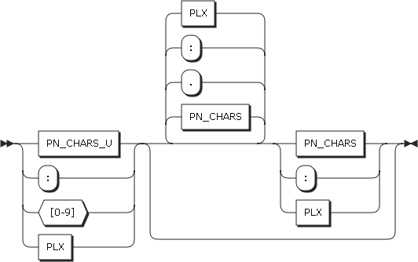 <map name="PN_LOCAL.map"><area shape="rect" coords="49,79,151,111" href="#PN_CHARS_U" title="PN_CHARS_U"> <area shape="rect" coords="231,45,317,77" href="#PN_CHARS" title="PN_CHARS"> <area shape="rect" coords="357,79,443,111" href="#PN_CHARS" title="PN_CHARS"></map>

<div class="ebnf">

<pre>[PN_LOCAL](#PN_LOCAL "PN_LOCAL") ::= ( [PN_CHARS_U](#PN_CHARS_U "PN_CHARS_U") | [0-9] ) ( ( [PN_CHARS](#PN_CHARS "PN_CHARS") | '.' )* [PN_CHARS](#PN_CHARS "PN_CHARS") )?</pre>

</div>

referenced by:

*   [BLANK_NODE_LABEL](#BLANK_NODE_LABEL "BLANK_NODE_LABEL")
*   [PNAME_LN](#PNAME_LN "PNAME_LN")

* * *

 <nobr class="signature">... generated by [Railroad Diagram Generator](http://www.bottlecaps.de/rr/ui "http://www.bottlecaps.de/rr/ui")</nobr> | [](http://www.bottlecaps.de/rr/ui "http://www.bottlecaps.de/rr/ui") |
